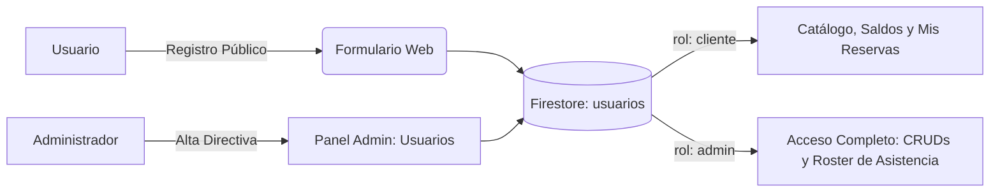

<div align="center">
  
  <h1>Hara Vitalis - Studio & Bienestar Integral</h1>
  <p><strong>Plataforma Web de Gestión, Agendamiento y Administración para Pilates Reformer y Medicina Tradicional China</strong></p>

  [](https://react.dev/)
  [](https://vitejs.dev/)
  [](https://firebase.google.com/)
  [](https://developer.mozilla.org/es/docs/Web/CSS)
  [](https://vitest.dev/)
</div>

---

## Tabla de Contenidos

- [Descripción General](#descripción-general)
- [Características Principales](#características-principales)
- [Stack Tecnológico](#stack-tecnológico)
- [Instalación y Puesta en Marcha](#instalación-y-puesta-en-marcha)
  - [Requisitos Previos](#requisitos-previos)
  - [Variables de Entorno](#variables-de-entorno)
  - [Comandos de Ejecución](#comandos-de-ejecución)
- [Gestión de Usuarios y Roles](#gestión-de-usuarios-y-roles)
  - [1. Registro de Clientes (Autoservicio)](#1-registro-de-clientes-autoservicio)
  - [2. Creación y Gestión Manual por Administrador](#2-creación-y-gestión-manual-por-administrador)
  - [3. Control de Saldos y Asistencias](#3-control-de-saldos-y-asistencias)
- [Administración del Servicio (Paneles CRUD)](#administración-del-servicio-paneles-crud)
  - [CRUD de Clases de Pilates Reformer](#crud-de-clases-de-pilates-reformer)
  - [CRUD de Terapias Integrativas](#crud-de-terapias-integrativas)
  - [CRUD de Usuarios y Reservas](#crud-de-usuarios-y-reservas)
- [Estructura del Proyecto](#estructura-del-proyecto)
- [Pruebas Automatizadas](#pruebas-automatizadas)

---

## Descripción General

**Hara Vitalis** es una solución integral diseñada para centros de bienestar, combinando el entrenamiento de alta precisión en **Pilates Reformer** con sesiones de **Medicina Tradicional China y Terapias Integrativas**. 

La aplicación proporciona una experiencia fluida tanto para alumnos que desean consultar planes, reservar horarios y gestionar sus cupos en tiempo real, como para los instructores y administradores encargados de la supervisión de asistencia, gestión de cupos y control de inventario horario.

---

## Características Principales

- **Motor de Agendamiento en Tiempo Real**: Visualización dinámica de un calendario de 4 semanas con actualización instantánea de cupos disponibles y plazas ocupadas.
- **Transacciones Atómicas Seguras**: Sistema de reservas respaldado por transacciones de Firestore que garantiza la imposibilidad de sobrecupo (*overbooking*) y previene dobles inscripciones.
- **Saldos Independientes**: Control diferenciado entre clases pactadas mensuales de Pilates y sesiones de terapia asignadas.
- **Cancelación Justa**: Política automática de anulación permitida hasta 15 horas antes de la sesión, reintegrando automáticamente el cupo al usuario.
- **Privacidad y Visibilidad Selectiva**: Los nombres de las personas inscritas en cada horario son visibles única y exclusivamente para usuarios con rol de administrador.
- **Diseño Responsive Pro Max**: Maquetación adaptada a todos los tamaños de pantalla, garantizando visualización sin desbordamiento horizontal desde dispositivos móviles ultra-compactos de 320 px hasta pantallas de escritorio.

---

## Stack Tecnológico

| Capa | Tecnología | Propósito |
| :--- | :--- | :--- |
| **Frontend Core** | React 19 + Vite | Arquitectura de componentes desacoplados y empaquetado ultra-rápido. |
| **Backend & Base de Datos** | Firebase Firestore | Persistencia en la nube, listeners en tiempo real y transacciones ACID. |
| **Autenticación** | Firebase Auth | Inicio de sesión, registro seguro y control de sesiones. |
| **Estilos** | CSS3 Vanilla Moderno | Variables CSS (Custom Properties), Flexbox, CSS Grid y tipografía fluida con `clamp()`. |
| **Testing** | Vitest + Testing Library | Pruebas unitarias de componentes, lógica de negocio y permisos de rol. |

---

## Instalación y Puesta en Marcha

### Requisitos Previos

- **Node.js**: Versión 18.0.0 o superior.
- **npm** o **pnpm** como gestor de paquetes.
- Un proyecto configurado en [Firebase Console](https://console.firebase.google.com/).

### Variables de Entorno

Crea un archivo `.env` en la raíz del proyecto tomando como referencia las credenciales de tu consola de Firebase:

```env
VITE_FIREBASE_API_KEY=tu_api_key
VITE_FIREBASE_AUTH_DOMAIN=tu_proyecto.firebaseapp.com
VITE_FIREBASE_PROJECT_ID=tu_proyecto_id
VITE_FIREBASE_STORAGE_BUCKET=tu_proyecto.appspot.com
VITE_FIREBASE_MESSAGING_SENDER_ID=tu_sender_id
VITE_FIREBASE_APP_ID=tu_app_id
```

### Comandos de Ejecución

```bash
# 1. Instalar dependencias
npm install

# 2. Iniciar entorno de desarrollo local
npm run dev

# 3. Ejecutar suite de pruebas unitarias
npm run test

# 4. Compilar para producción
npm run build

# 5. Previsualizar compilación de producción
npm run preview
```

---

## Gestión de Usuarios y Roles

La plataforma implementa un modelo de control de acceso basado en roles (`rol: "cliente"` | `rol: "admin"`).



### 1. Registro de Clientes (Autoservicio)

Los usuarios generales pueden darse de alta de forma autónoma:
1. Acceder al botón **Registrarse** en la barra de navegación o en las tarjetas de planes de la página de inicio.
2. Ingresar nombre completo, correo electrónico y contraseña.
3. El sistema registra la cuenta en Firebase Authentication y crea automáticamente el documento correspondiente en la colección `usuarios` con `rol: "cliente"`, `estado_cuenta: "activo"` y saldos iniciales en 0.

### 2. Creación y Gestión Manual por Administrador

Los administradores pueden gestionar usuarios directamente desde el panel:
1. Iniciar sesión con una cuenta que tenga el campo `rol: "admin"` en Firestore.
2. Hacer clic en **Panel Admin** en el menú superior y seleccionar la pestaña **Usuarios**.
3. Presionar el botón **+ Nuevo Usuario**.
4. Completar los datos requeridos:
   - Nombre y correo electrónico.
   - Teléfono de contacto.
   - Rol asignado (`cliente` o `admin`).
   - Estado de la cuenta (`activo` o `inactivo`).
   - Carga inicial de clases pactadas y sesiones de terapia.

> [!NOTE]
> Cuando se crea un usuario desde el panel administrativo, se registra su ficha en Firestore para vincular compras presenciales, transferencias bancarias o contratos previos.

### 3. Control de Saldos y Asistencias

- **Abono de Clases**: Desde la tabla de usuarios, el administrador puede incrementar o reducir las clases pactadas y terapias con los botones rápidos `+1` / `-1`.
- **Roster de Asistencia Protegido**: Al ingresar a la vista de agendamiento (`BookingPage`), los usuarios con rol de administrador verán el bloque `🛡️ Admin` en cada tarjeta de horario, revelando los nombres completos y correos de las personas que reservaron ese bloque. Para clientes comunes, esta información permanece oculta.

---

## Administración del Servicio (Paneles CRUD)

El panel administrativo (`AdminClasesPage`) centraliza tres módulos de mantenimiento esenciales:

```
Panel de Administración (AdminClasesPage)
├── 🧘‍♀️ Pestaña Clases: CRUD de Clases de Pilates Reformer
├── 🌿 Pestaña Terapias: CRUD de Terapias Integrativas y MTC
└── 👥 Pestaña Usuarios: CRUD de Usuarios, Saldos y Cancelación de Inscripciones
```

### CRUD de Clases de Pilates Reformer

Permite programar la grilla horaria semanal y mensual de las camas de Reformer:
- **Crear**: Configuración de horario de inicio, término, instructor asignado, cupo máximo (por defecto 5 plazas) y estado (`activa` / `inactiva`).
- **Leer**: Filtros por estado, buscador por nombre de instructor o tipo de servicio, y orden cronológico.
- **Actualizar**: Edición de instructores, reprogramación de horarios o cierre de cupos.
- **Eliminar**: Baja lógica o borrado definitivo de sesiones con advertencia de confirmación.

### CRUD de Terapias Integrativas

Gestión del catálogo de servicios holísticos y Medicina Tradicional China:
- **Campos Administrables**: Título de la terapia, descripción clínica, terapeuta responsable, duración en minutos, precio promocional y precio de lista tachado.
- **Etiquetas Visuales**: Asignación de badges promocionales (`Sesión Individual`, `Plan Recomendado`, `Máximo Ahorro`).
- **Control de Disponibilidad**: Activación o pausa de terapias específicas sin alterar el historial previo.

### CRUD de Usuarios y Reservas

- **Supervisión de Clientes**: Búsqueda por nombre o correo, visualización de saldo activo y estado de membresía.
- **Auditoría de Reservas**: Visualización de todas las clases o terapias inscritas por cada usuario.
- **Cancelación Administrativa**: Capacidad de anular reservas puntuales de cualquier alumno, restituyendo automáticamente el saldo de clase o terapia a la cuenta del usuario.

> [!IMPORTANT]
> Las anulaciones ejecutadas por el administrador no están sujetas a la restricción horaria de 15 horas, permitiendo gestionar excepciones de fuerza mayor o emergencias médicas.

---

## Estructura del Proyecto

```text
huravitalis/
├── public/                 # Recursos multimedia estáticos (logos, favicons, fotos)
├── src/
│   ├── assets/             # Fuentes locales (Montserrat, Great Vibes)
│   ├── components/         # Componentes modulares y vistas
│   │   ├── AdminClasesPage.jsx    # Panel maestro de administración
│   │   ├── AdminTerapiasTab.jsx   # Pestaña CRUD de Terapias
│   │   ├── AdminUsuariosTab.jsx   # Pestaña CRUD de Usuarios e Inscripciones
│   │   ├── AuthPage.jsx           # Vistas de Login y Registro
│   │   ├── BookingPage.jsx        # Módulo de agendamiento y reservas
│   │   ├── HomePage.jsx           # Página principal y catálogo de membresías
│   │   ├── Navbar.jsx             # Barra de navegación con accesos por rol
│   │   └── TerapiasPage.jsx       # Catálogo detallado de Medicina China
│   ├── firebase/           # Capa de integración con servicios de Google Firebase
│   │   ├── config.js              # Inicialización de la app de Firebase
│   │   ├── authService.js         # Operaciones de autenticación
│   │   ├── clasesService.js       # Operaciones de clases de Pilates
│   │   ├── terapiasService.js     # Operaciones de terapias MTC
│   │   ├── usuariosService.js     # Operaciones de usuarios e inscripciones
│   │   └── inscripcionesService.js# Transacciones atómicas de reserva y anulación
│   ├── test/               # Pruebas unitarias automatizadas con Vitest
│   ├── App.jsx             # Enrutador principal y control de estado de sesión
│   ├── index.css           # Sistema de diseño, temas y media queries responsive
│   └── main.jsx            # Punto de entrada de la aplicación
├── package.json            # Scripts y dependencias del ecosistema
└── vite.config.js          # Configuración del empaquetador Vite
```

---

## Pruebas Automatizadas

El proyecto incluye pruebas automatizadas ejecutadas mediante **Vitest** y **React Testing Library** para asegurar la estabilidad en cada despliegue:

```bash
# Ejecutar todas las pruebas unitarias
npm run test
```

### Cobertura de Pruebas:
- Renderizado de componentes clave y catálogos de precios.
- Filtrado dinámico de membresías en tiempo real.
- Flujos de autenticación e interacción en reservas.
- **Aislamiento de Privacidad**: Verificación estricta de que el listado de personas inscritas no sea expuesto a usuarios regulares y se muestre correctamente al administrador.
