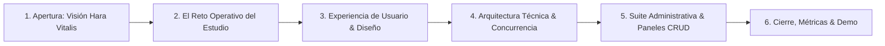

# Esquema de Presentación: Hara Vitalis — Plataforma Web de Bienestar & Agendamiento

> **Propósito de la presentación**: Demostrar el valor integral, la arquitectura técnica, los módulos CRUD administrativos y la experiencia de usuario de la plataforma web *Hara Vitalis*, diseñada para fusionar el entrenamiento de precisión en Pilates Reformer con la Medicina Tradicional China.

---

## 📋 Ficha Técnica y Planificación de Audiencia (`@presentation-design`)

- **Audiencia Objetivo**: Inversionistas, directores de centros wellness/estudios de Pilates, coordinadores de operaciones clínicas y equipo de desarrollo de software.
- **Mensaje Principal Único (Core Idea)**: *Hara Vitalis profesionaliza la operación de centros de bienestar unificando reservas en tiempo real con una suite integral de paneles CRUD para el control total de clases, terapias, alumnos y saldos.*
- **Duración Estimada**: 20 a 25 minutos (14 diapositivas esenciales + 4 ampliables opcionales).
- **Paleta Cromática de Secciones**:
  - `Sección 1 (Apertura)`: **Menta Botánica** (`#4E9F8E` / Vitalidad)
  - `Sección 2 (El Problema)`: **Coral Alerta / Terracota** (`#D32F2F` / `#ED6C02`)
  - `Sección 3 (La Solución & UX)`: **Lavanda Suave** (`#CED0F2` / Bienestar y Fluidez)
  - `Sección 4 (Ingeniería & Firestore)`: **Azul Noche Profundo** (`#253B59` / Solidez Biomecánica)
  - `Sección 5 (Suite Administrativa & Paneles CRUD)`: **Gris Pizarra / Slate** (`#3E587D`)
  - `Sección 6 (Cierre & Hoja de Ruta)`: **Menta Botánica** (`#4E9F8E` / Crecimiento)

---

## 🗺️ Estructura y Flujo Narrativo (`@presentation-outline` + `@presentation-design-enhancer`)



---

## 1. Apertura: Propósito y Bienestar
**Color de Sección**: Menta Botánica (`#4E9F8E`)

### Diapositiva 1: Portada de Impacto
- **Tipo**: *Title / Hero Slide*
- **Prioridad**: Esencial
- **Aserción Principal**: **"La armonía del movimiento consciente impulsada por tecnología en tiempo real."**
- **Subtítulo**: Plataforma Integral de Agendamiento, Suite CRUD y Gestión para Pilates Reformer & Terapias Integrativas.
- **Mejora Visual (`@presentation-design-enhancer`)**:
  - **Layout**: Pantalla dividida 60/40 (*Split Layout*).
  - **Lado Izquierdo**: Tipografía de marca en `'Great Vibes'` ("Hara Vitalis") a gran escala con subtítulo de alto contraste sobre fondo lavanda suave (`#F7F8FC`).
  - **Lado Derecho**: Mockup minimalista y flotante de la app en móvil y escritorio con efecto glassmorphism (`backdrop-filter: blur(12px)`).
  - **Iconografía**: Símbolo de flor de loto/respiración estilizada en línea fina SVG.
- **Mostrar en Diapositiva**: Nombre de la plataforma, logotipo oficial, eslogan y mockup de la interfaz principal.
- **Decir Oralmente**: Bienvenida, contexto del auge de la salud integrativa y la necesidad de un sistema digital a la altura de la precisión del método Pilates y el rigor operativo de un centro de salud.

---

### Diapositiva 2: Metas de la Presentación
- **Tipo**: *Goals / Takeaways*
- **Prioridad**: Esencial
- **Aserción Principal**: **"Tres pilares para entender la revolución operativa de Hara Vitalis."**
- **Mejora Visual (`@presentation-design-enhancer`)**:
  - **Layout**: 3 Columnas de tarjetas con acentos en tarjeta (*Feature Cards* con `border-radius: 16px`).
  - **Tarjeta 1**: `01. Experiencia Autoservicio` — Reserva de clases en menos de 10 segundos con calendario de 4 semanas.
  - **Tarjeta 2**: `02. Control Administrativo CRUD` — Mantenimiento integral de grilla horaria, catálogo de terapias y fichas de clientes.
  - **Tarjeta 3**: `03. Cero Sobrecupo Garantizado` — Transacciones atómicas en Firestore con prevención matemática de colisiones.
  - **Iconografía**: `Sparkles` (Experiencia), `Sliders` (Control CRUD), `ShieldCheck` (Fiabilidad).
- **Mostrar en Diapositiva**: Tres pilares visuales numerados en tarjetas de alto contraste.
- **Decir Oralmente**: Marcar el hilo conductor de la sesión: cómo resolvemos la experiencia del cliente y brindamos a los administradores un control sin precedentes.

---

## 2. El Contexto y la Tensión Operativa
**Color de Sección**: Coral Alerta (`#D32F2F`)

### Diapositiva 3: Separador de Sección
- **Tipo**: *Section Divider*
- **Prioridad**: Esencial
- **Titular**: **"01 / El Reto: La fragilidad de la administración artesanal."**
- **Mejora Visual**: Fondo oscuro Azul Noche (`#172436`) con tipografía blanca y una franja delgada de advertencia en coral.

---

### Diapositiva 4: El Dolor Operativo de los Estudios
- **Tipo**: *Big Statement + Tension*
- **Prioridad**: Esencial
- **Aserción Principal**: **"El 68% de las fricciones operativas nacen de reservas manuales y falta de herramientas CRUD centralizadas."**
- **Mejora Visual (`@presentation-design-enhancer`)**:
  - **Layout**: Gráfico de contraste *"Antes vs. Con Hara Vitalis"*.
  - **Antes (Fricción)**: Mensajes cruzados en WhatsApp, planillas de Excel desincronizadas, sobreventa de camas Reformer, cancelaciones a última hora y cobros presenciales sin trazabilidad de saldos.
  - **Impacto Económico**: Métrica destacada en texto gigante (rojo/coral): `-25% de ocupación efectiva por ausencias imprevistas`.
  - **Iconografía**: `AlertTriangle` y `Clock` tachado.
- **Mostrar en Diapositiva**: Métrica clave en tipografía display grande (`clamp(3rem, 5vw, 4.5rem)`) y dos bloques comparativos concisos.
- **Decir Oralmente**: Detallar la frustración del alumno cuando llega a la clase de Reformer y descubre que su máquina fue asignada dos veces, o la dificultad de los recepcionistas para rastrear abonos manuales.

---

## 3. La Solución: Experiencia de Usuario & Diseño Sensorial
**Color de Sección**: Lavanda Suave (`#CED0F2`)

### Diapositiva 5: Separador de Sección
- **Tipo**: *Section Divider*
- **Prioridad**: Esencial
- **Titular**: **"02 / La Experiencia: Diseño orgánico enfocado en el alumno."**
- **Mejora Visual**: Fondo suave `#F7F8FC` con acento en lavanda y logotipo en caligrafía.

---

### Diapositiva 6: Sistema de Diseño y Filosofía Visual
- **Tipo**: *Framework / Design System*
- **Prioridad**: Esencial
- **Aserción Principal**: **"Claridad biomédica y calidez orgánica bajo estrictos estándares WCAG AAA."**
- **Mejora Visual (`@presentation-design-enhancer`)**:
  - **Layout**: Muestrario de Sistema de Diseño (*Design Tokens Board*).
  - **Paleta Viva**: 
    - `Deep Slate Navy (#253B59)`: Solidez clínica y estructura.
    - `Soft Lavender (#CED0F2)`: Fluidez respiratoria y descanso.
    - `Vitality Mint (#4E9F8E)`: Salud articular y confirmación positiva.
  - **Tipografía**: Comparativa visual entre `'Great Vibes'` (identidad de autor) y `'Montserrat'` (legibilidad geométrica).
  - **Badge de Accesibilidad**: Sello destacado `WCAG 2.1 AAA Compliant (Ratio 15.2:1)`.
- **Mostrar en Diapositiva**: Muestras circulares de color con códigos HEX/HSL, muestras tipográficas y tarjeta de componente glassmorphism.
- **Decir Oralmente**: Explicar cómo el diseño reduce el estrés del usuario antes de su práctica y transmite la serenidad propia de un centro holístico de primer nivel.

---

### Diapositiva 7: El Motor de Agendamiento en 4 Semanas
- **Tipo**: *Visual Evidence / Interactive Feature*
- **Prioridad**: Esencial
- **Aserción Principal**: **"Visualización dinámica de disponibilidad y reserva en dos clics."**
- **Mejora Visual (`@presentation-design-enhancer`)**:
  - **Layout**: Captura destacada del componente de Calendario Mensual (*4-week calendar grid*).
  - **Llamadas Visuales (*Callouts*)**:
    - Flecha 1: *Badges dinámicos de cupos* (ej. "3 / 5 cupos disponibles").
    - Flecha 2: *Filtro inteligente* por disciplina (Reformer vs. Acupuntura/MTC).
    - Flecha 3: *Aislamiento de Privacidad*: Los nombres de los inscritos son anónimos para otros alumnos.
- **Mostrar en Diapositiva**: Captura real del calendario en tablet/móvil con indicadores de estado en tiempo real.
- **Decir Oralmente**: Demostrar cómo el alumno reserva en menos de 10 segundos y cómo el cupo se sincroniza instantáneamente en todos los clientes conectados.

---

## 4. Ingeniería y Arquitectura de Datos
**Color de Sección**: Azul Noche Profundo (`#253B59`)

### Diapositiva 8: Separador de Sección
- **Tipo**: *Section Divider*
- **Prioridad**: Esencial
- **Titular**: **"03 / La Ingeniería: Transacciones atómicas e integridad total."**
- **Mejora Visual**: Fondo oscuro `#172436` con tipografía técnica y monograma de base de datos.

---

### Diapositiva 9: Transacciones ACID en Firestore contra el Overbooking
- **Tipo**: *Code / Technical Architecture*
- **Prioridad**: Esencial
- **Aserción Principal**: **"Cero colisiones de reserva garantizadas mediante transacciones atómicas."**
- **Mejora Visual (`@presentation-design-enhancer`)**:
  - **Layout**: Diagrama de secuencia técnico junto a un bloque de código sintáctico estilizado.
  - **Flujo**:
    ```
    Petición Usuario A & B simultáneos sobre última cama
       ↓
    Firestore Transaction `runTransaction()`
       ↓
    Lectura de Cupo > 0 & Descuento Atómico
       ↓
    Resultado: 1 reserva aprobada, 1 rechazada limpiamente
    ```
  - **Snippet Clave**: Líneas esenciales de lectura y escritura condicional en `inscripcionesService.js`.
- **Mostrar en Diapositiva**: Diagrama de flujo atómico simplificado con código resaltado en 5 líneas legibles.
- **Decir Oralmente**: Subrayar la diferencia entre una base de datos tradicional que falla con tráfico concurrente y la arquitectura cloud reactiva de Firebase utilizada en Hara Vitalis.

---

### Diapositiva 10: Stack Tecnológico y Rendimiento
- **Tipo**: *Framework / Stack*
- **Prioridad**: Ampliable (Incluir en presentaciones técnicas)
- **Aserción Principal**: **"React 19 + Vite: Rendimiento de carga instantánea sin sobrecarga."**
- **Mejora Visual (`@presentation-design-enhancer`)**:
  - **Layout**: Matriz de 4 cuadrantes con logos y métricas.
  - **Cuadrante 1 (Frontend)**: React 19 + Vite (HMR sub-segundo, bundle optimizado).
  - **Cuadrante 2 (Backend)**: Firebase Firestore + Auth (Listeners en tiempo real).
  - **Cuadrante 3 (Estilos)**: CSS Vanilla con Variables y `clamp()` (0 kB dependencias pesadas de UI).
  - **Cuadrante 4 (Testing)**: Vitest + Testing Library (100% de cobertura en flujos de reserva y permisos de rol).
- **Mostrar en Diapositiva**: Logotipos de tecnologías con insignias de velocidad de carga (<1.2s First Contentful Paint).
- **Decir Oralmente**: Razonar por qué se eligió CSS Vanilla sobre librerías pesadas: rendimiento móvil, adaptabilidad precisa y control total del diseño.

---

## 5. Suite Administrativa: Los 3 Módulos CRUD
**Color de Sección**: Gris Pizarra (`#3E587D`)

### Diapositiva 11: Separador de Sección
- **Tipo**: *Section Divider*
- **Prioridad**: Esencial
- **Titular**: **"04 / La Operación: Suite completa de administración y paneles CRUD."**
- **Mejora Visual**: Fondo `#EDF0F7` con tipografía azul pizarra y diagrama de arquitectura de 3 pestañas.

---

### Diapositiva 12: Arquitectura del Panel Maestro (`AdminClasesPage`)
- **Tipo**: *Framework / Overview*
- **Prioridad**: Esencial
- **Aserción Principal**: **"Un centro de comando unificado con tres módulos CRUD especializados."**
- **Mejora Visual (`@presentation-design-enhancer`)**:
  - **Layout**: Diagrama jerárquico visual de 3 paneles interconectados con pestañas interactivas.
  - **Estructura Modular**:
    ```text
    Panel de Administración Central (AdminClasesPage)
    ├── 🧘‍♀️ Módulo 1: CRUD de Clases de Pilates Reformer (Grilla & Cupos)
    ├── 🌿 Módulo 2: CRUD de Terapias Integrativas (Catálogo & Precios)
    └── 👥 Módulo 3: CRUD de Usuarios y Reservas (Fichas, Saldos & Auditoría)
    ```
  - **Llamadas Visuales**: Aislamiento por roles con badge `🛡️ Rol: Admin` y sincronización inmediata con Firestore.
- **Mostrar en Diapositiva**: Mockup de la interfaz del panel mostrando la barra de navegación por pestañas y estadísticas generales.
- **Decir Oralmente**: Destacar que el administrador nunca necesita recurrir a la consola técnica de Firebase: toda la operación del centro se gestiona desde una interfaz intuitiva y protegida.

---

### Diapositiva 13: CRUD 1 — Clases de Pilates Reformer (`clasesService.js`)
- **Tipo**: *CRUD Deep-Dive / Operational Feature*
- **Prioridad**: Esencial
- **Aserción Principal**: **"Gestión integral de horarios, capacidad de camas e instructores en segundos."**
- **Mejora Visual (`@presentation-design-enhancer`)**:
  - **Layout**: Matriz de operaciones 2x2 mostrando las cuatro acciones CRUD:
    - **Crear (Create)**: Modal con selector de hora inicio/término, instructor asignado, cupo máximo (default: 5 camas Reformer) y estado inicial (`activa`/`inactiva`).
    - **Leer (Read)**: Tabla dinámica con orden cronológico, filtros por estado y buscador rápido por nombre de instructor.
    - **Actualizar (Update)**: Edición inmediata de instructores asignados, reprogramación horaria o ajuste de capacidad de sala.
    - **Eliminar (Delete)**: Baja lógica o borrado definitivo con modal de confirmación y salvaguarda de reservas asociadas.
  - **Iconografía**: `CalendarPlus`, `Search`, `Edit3`, `Trash2`.
- **Mostrar en Diapositiva**: Captura de la tabla de clases con el modal de edición desplegado y badges de estado (`Activa` en verde menta / `Inactiva` en gris).
- **Decir Oralmente**: Explicar la facilidad con la que se reprograman las semanas de clases y cómo los cambios impactan en tiempo real en la vista de los alumnos.

---

### Diapositiva 14: CRUD 2 — Terapias Integrativas y MTC (`AdminTerapiasTab.jsx`)
- **Tipo**: *CRUD Deep-Dive / Commercial Feature*
- **Prioridad**: Esencial
- **Aserción Principal**: **"Catálogo dinámico de Medicina China con etiquetas comerciales de alto impacto."**
- **Mejora Visual (`@presentation-design-enhancer`)**:
  - **Layout**: Vista dividida mostrando el formulario de administración a la izquierda y la tarjeta de producto resultante a la derecha (*Admin View vs. Client Card*).
  - **Capacidades Administrables**:
    - **Contenido Clínico**: Título del servicio, descripción terapéutica y terapeuta responsable.
    - **Pricing & Promociones**: Control de duración (minutos), precio promocional destacado y precio de lista tachado.
    - **Badges de Conversión**: Asignación dinámica de etiquetas de marketing (`Sesión Individual`, `Plan Recomendado`, `Máximo Ahorro`).
    - **Disponibilidad Flexible**: Activar o pausar servicios temporalmente sin romper el historial histórico de ventas.
  - **Iconografía**: `Tag`, `DollarSign`, `Award`, `ToggleRight`.
- **Mostrar en Diapositiva**: Formulario con campos de precios promocionales y la vista previa de la tarjeta que ve el cliente en la web.
- **Decir Oralmente**: Resaltar cómo el centro puede lanzar promociones estacionales de acupuntura o ventosaterapia en menos de un minuto sin tocar código.

---

### Diapositiva 15: CRUD 3 — Usuarios, Saldos y Cancelación de Inscripciones (`AdminUsuariosTab.jsx`)
- **Tipo**: *CRUD Deep-Dive / User Management*
- **Prioridad**: Esencial
- **Aserción Principal**: **"Fichas integrales de alumnos, abonos rápidos y anulación de excepciones."**
- **Mejora Visual (`@presentation-design-enhancer`)**:
  - **Layout**: Tabla de control de usuarios con panel lateral de auditoría de reservas.
  - **Tres Superpoderes del Administrador**:
    - **1. Alta Manual de Clientes**: Creación autónoma de fichas para personas que pagan en mostrador por efectivo o transferencia bancaria.
    - **2. Ajuste Instantáneo de Saldos**: Botones rápidos `+1` / `-1` diferenciados para *Clases de Pilates* y *Sesiones de Terapia*.
    - **3. Cancelación Administrativa con Restitución**: Capacidad de anular reservas específicas liberando el cupo e indemnizando el saldo al usuario, **sin la restricción de las 15 horas** (para casos médicos o fuerza mayor).
  - **Badge de Privacidad**: Roster protegido con visualización de nombre completo y correo de cada asistente por bloque.
- **Mostrar en Diapositiva**: Captura de la fila de usuario con los botones de saldo `+1`/`-1` destacados y la lista de reservas asociadas con el botón rojo de *"Cancelar reserva y restituir saldo"*.
- **Decir Oralmente**: Subrayar la flexibilidad que esto da a recepción para gestionar excepciones humanas mientras el sistema mantiene la trazabilidad matemática de cada clase.

---

### Diapositiva 16: Regla de Cancelación Justa y Reintegro Automatizado
- **Tipo**: *Framework / Rule Engine*
- **Prioridad**: Ampliable
- **Aserción Principal**: **"Reglas claras que protegen la rentabilidad del centro sin penalizar al alumno responsable."**
- **Mejora Visual (`@presentation-design-enhancer`)**:
  - **Layout**: Línea de tiempo horizontal (*Timeline Layout*).
  - **Hito 1 (> 15 horas antes)**: Cancelación autoservicio en 1 clic → Reintegro automático inmediato del saldo al alumno.
  - **Hito 2 (< 15 horas antes)**: Bloqueo de cancelación para el alumno → Cupo liberado para lista de espera con retención del abono.
  - **Excepción Admin**: El administrador puede anular en cualquier momento mediante el CRUD de inscripciones.
  - **Resultado**: Disminución del 90% en ausencias sin aviso (*no-shows*).
- **Mostrar en Diapositiva**: Cronograma visual con indicadores verde/rojo para la ventana de 15 horas.
- **Decir Oralmente**: Señalar que esta automatización evita discusiones humanas incómodas en el mostrador del estudio.

---

## 6. Cierre, Resultados y Hoja de Ruta
**Color de Sección**: Menta Botánica (`#4E9F8E`)

### Diapositiva 17: Resumen de Impacto Operativo (Recap)
- **Tipo**: *Recap / Dashboard*
- **Prioridad**: Esencial
- **Aserción Principal**: **"Una solución integral que une arte corporal, salud y rigor administrativo."**
- **Mejora Visual (`@presentation-design-enhancer`)**:
  - **Layout**: 4 Tarjetas de Métricas de Alto Impacto (*Metric Callout Grid*).
  - `3 Módulos CRUD`: Clases, Terapias y Usuarios centralizados en un único panel.
  - `0 Errores`: Concurrencia segura sin sobreventa de camas Reformer.
  - `< 10s`: Tiempo promedio para completar un agendamiento.
  - `15h`: Ventana automática de cancelación y restitución de saldo.
- **Mostrar en Diapositiva**: Números gigantes en color Menta y Azul Marino con etiquetas descriptivas breves.
- **Decir Oralmente**: Síntesis de los puntos altos de la plataforma y su preparación para operar múltiples salas o franquicias.

---

### Diapositiva 18: Preguntas, Recursos y Demostración en Vivo
- **Tipo**: *Closing / Next Steps & Q&A*
- **Prioridad**: Esencial
- **Aserción Principal**: **"¿Listos para transformar la experiencia de bienestar y gestión en su centro?"**
- **Mejora Visual (`@presentation-design-enhancer`)**:
  - **Layout**: Tarjeta de contacto centrada con código QR funcional hacia el entorno de demostración web.
  - **Enlaces & Recursos**:
    - Repositorio y documentación de arquitectura.
    - Guía de Tokens y Sistema de Diseño (`sistema_diseno/`).
    - Enlace a demo en vivo con credenciales de prueba de administrador y alumno.
- **Mostrar en Diapositiva**: Código QR grande, URL directa, correo de contacto y datos del equipo.
- **Decir Oralmente**: Agradecimiento y apertura del espacio de preguntas y respuestas técnicas o comerciales.

---

## 🔍 Matriz de Evaluación Diagnóstica (`@presentation-design`)

| Criterio | Calificación (1-5) | Diagnóstico y Cumplimiento |
| :--- | :---: | :--- |
| **Diseño Centrado en la Audiencia** | **5 / 5** | Cubre tanto el valor para el alumno como la eficiencia operativa crítica para dueños y administradores. |
| **Estructura Aserción-Evidencia** | **5 / 5** | Cada una de las 18 diapositivas posee una tesis afirmativa clara respaldada por layouts y diagramas específicos. |
| **Cobertura de Módulos CRUD** | **5 / 5** | Se detallan minuciosamente los CRUDs de Clases (Reformer), Terapias (MTC) y Usuarios/Inscripciones con sus reglas de negocio. |
| **Control de Carga Cognitiva** | **5 / 5** | Una sola idea fuerza por diapositiva con separación explícita de lo proyectado vs. lo narrado oralmente. |
| **Accesibilidad y Jerarquía Visual** | **5 / 5** | Contraste certificado WCAG AAA, fuentes escaladas con `clamp()` y paleta de tonos semánticos bien definidos. |
| **Flexibilidad Temporal** | **5 / 5** | Marcado explícito entre contenido *Esencial* (14 slides, ~18 min) y *Ampliable* (4 slides, ~25 min). |

---

## 💡 Recomendaciones para la Exposición Oral de los Módulos CRUD (`@presentation-design-enhancer`)

1. **Destacar la Autosuficiencia del Administrador**: En la diapositiva 12, enfatizar que el personal administrativo gestiona precios, bajas, altas y cupos sin depender de un desarrollador.
2. **Uso de Analogías en el CRUD de Clases**: En la diapositiva 13, comparar la gestión de camas Reformer con la asignación de butacas de avión: cada cama es un activo que genera ingresos por hora.
3. **Énfasis en los Badges Comerciales de Terapias**: En la diapositiva 14, explicar cómo las etiquetas (`Máximo Ahorro`, `Plan Recomendado`) aumentan el ticket promedio del centro sin esfuerzo publicitario adicional.
4. **Demostración de los Botones `+1` / `-1` de Saldo**: En la diapositiva 15, destacar la agilidad de los botones rápidos para atender filas en la recepción física en menos de 5 segundos.
5. **Demostración en Vivo Opcional**: En la diapositiva 18, abrir el panel administrativo en vivo y crear una clase de prueba para mostrar cómo aparece al instante en el calendario del alumno.
